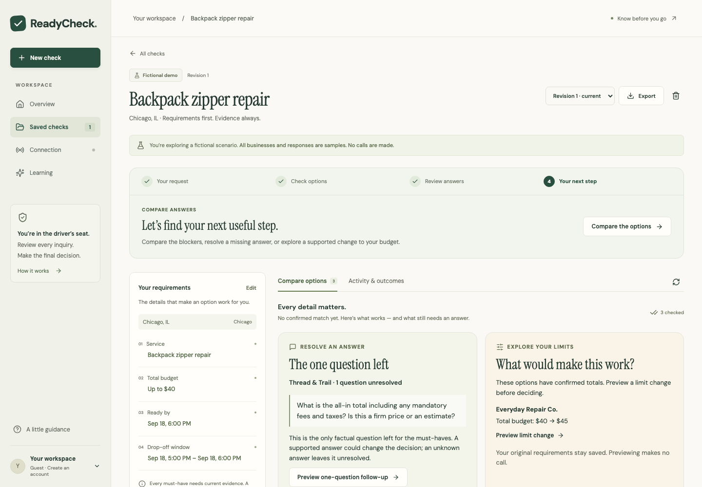
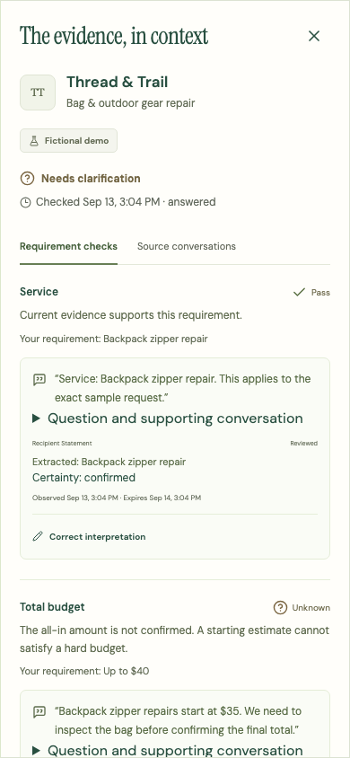
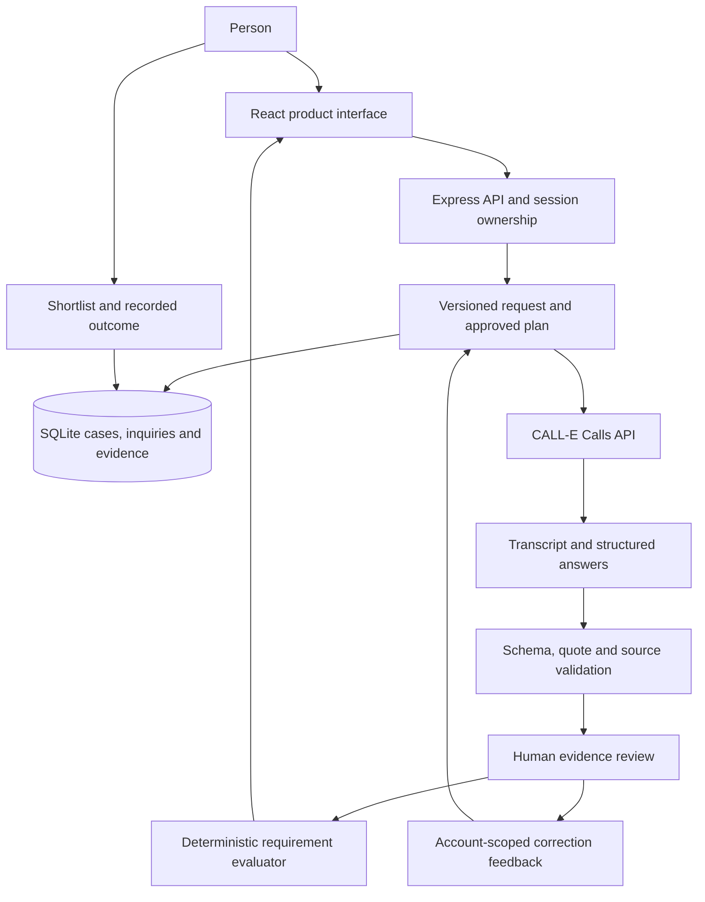

# ReadyCheck — Know Before You Go

[](https://nodejs.org/)
[](https://react.dev/)
[](tsconfig.json)
[](https://docs.heycall-e.com/calls)
[](https://github.com/ankitlade12/readycheck/actions/workflows/ci.yml)
[](#verify)
[](#verify)
[](LICENSE)

> **A business answering the phone is only the beginning. Know whether its answer actually meets your request.**

ReadyCheck turns a practical request into a requirement-by-requirement comparison backed by conversation evidence. Ask whether a shop can repair a backpack before Friday, within your budget, and at a time you can drop it off. Review what was said, resolve the missing detail, and choose the next step.

CALL-E handles approved phone inquiries. ReadyCheck handles the request, durable execution, source review, comparison, and the user's decision. Estimates, contradictions and missing answers stay visible.

**Built for:** [CALL-E: Your Code Is Calling](https://call-e.devpost.com/)<br>
**Try it:** [Open the fictional demo](https://readycheck-demo.up.railway.app) — no credentials or phone calls<br>
**Source:** [ankitlade12/readycheck](https://github.com/ankitlade12/readycheck)<br>
**Contribution:** [Upstream PR #570](https://github.com/CALLE-AI/awesome-phone-call-agents/pull/570)

## Quick Highlights

- **The whole request:** compare service or item identity, total price, dates and availability together.
- **Evidence beside each answer:** inspect exact recipient quotes, supporting questions, source segments and freshness.
- **A private budget:** the caller is instructed to ask the shop's price first and negotiate once when needed.
- **Useful follow-ups:** preview the single unresolved question that could change the decision.
- **Explicit tradeoffs:** explore a supported budget change and save it as a new revision; the original request stays intact.
- **Reviewable corrections:** fix interpretation, certainty, conditions and source references while retaining the original evidence.
- **Bounded learning:** account-scoped feedback selects or pauses two known extraction-repair methods.
- **Durable call recovery:** preserve the approved request and idempotency key, pause uncertain dispatches, and recover the original operation.
- **A complete user journey:** save cases, shortlist options, record an arrangement or outcome, and export the evidence.
- **No-call default:** fictional samples and automated tests require no CALL-E credentials and never dial.

[Railway deployment status and hosting options](docs/DEPLOYMENT.md)

## Product Preview



<details>
<summary>View the mobile evidence experience</summary>



</details>

Screenshots use fictional businesses and responses. They demonstrate the product workflow, not current business availability.

## The Problem

A business directory can tell you who exists. It rarely tells you whether someone can meet all the conditions that matter today.

A repair shop may offer the right service but miss the deadline. A low starting price may exclude required fees. A rental may be the wrong model, need an unaffordable deposit, or be unavailable during your pickup window. A friendly “yes” may answer only one part of a compound question.

ReadyCheck keeps those distinctions visible so that a promising conversation does not become an unsupported recommendation.

## The Product

The journey starts with a structured request and ends with a human-recorded next step:

1. Describe a repair, item/rental, or venue request and review its must-haves and preferences.
2. Choose recipients and inspect the questions before approving an inquiry.
3. Track dispatch, provider handling and result preparation.
4. Review extracted answers against the recipient's words and question context.
5. Compare matches, blockers, uncertain answers and expired evidence.
6. Ask a focused follow-up or explicitly revise a supported requirement.
7. Shortlist an option, record what you arranged, and save the eventual outcome.

A passing comparison does not make a booking. ReadyCheck never pays, accepts terms, or marks real-world completion on the user's behalf.

## Why CALL-E

The missing information lives with the person answering the business phone. CALL-E supplies the phone interaction and structured result; ReadyCheck supplies the approved scope and checks the returned evidence.

| Workflow step           | Implementation                                                                |
| ----------------------- | ----------------------------------------------------------------------------- |
| Prepare the inquiry     | Compile the reviewed request into one versioned conversation policy           |
| Create the call         | Server-side `POST /v1/calls`, explicit recipient and stable idempotency key   |
| Specify extraction      | Both result schemas restrict facts to the approved requirement IDs            |
| Observe progress        | Read the existing task with `GET /v1/calls/{id}`                              |
| Recover a lost response | One user-requested replay of the exact stored body and original key           |
| Use the answer          | Validate provenance, require live evidence review, then evaluate requirements |

The direct HTTP adapter lives in [server/calle.ts](server/calle.ts). It uses the documented CALL-E Calls API; it does not depend on a private SDK or agent CLI login.

**Live validation boundary:** earlier app-originated calls established runtime execution and transcript persistence. The latest recorded call kept the budget private but failed the intended negotiation and had screening and role-confusion problems. Policy 1.3.0 addresses those behaviors in its instructions and local regressions; it has not yet been validated in another live call. CALL-E controls speech and does not invoke the local rehearsal controller before each turn.

## Architecture Overview



### Technology Stack

| Layer        | Technology                    | Purpose                                                   |
| ------------ | ----------------------------- | --------------------------------------------------------- |
| Interface    | React 19 + Vite 7             | Guided intake, progress, comparison and evidence review   |
| Language     | Strict TypeScript             | Shared requirement, evidence and workflow contracts       |
| Server       | Express 5 on Node.js          | Session ownership, validation and provider access         |
| Storage      | SQLite with WAL               | Durable accounts, revisions, inquiries and review history |
| Validation   | Zod + JSON Schema             | Runtime input checks and constrained provider extraction  |
| Calling      | CALL-E Calls REST API         | Approved inquiries and structured call results            |
| Verification | Node test runner + Playwright | Domain, HTTP, fault and browser workflow checks           |
| Packaging    | Docker + Railway / Render     | One persistent Node instance with a database volume       |

## Judge Quick Start

[Open the hosted demo](https://readycheck-demo.up.railway.app) and follow the walkthrough below. No signup or CALL-E credentials are needed. The first request after inactivity may take longer while the service wakes up.

### Run locally

Use **Node.js 24** and npm. The application minimum is Node 22.13; the backup script requires 22.16 or newer.

```sh
git clone https://github.com/ankitlade12/readycheck.git
cd readycheck
npm ci
npm run dev
```

Open **http://localhost:3000**. No API key, credit card, or cloud account is needed for the sample journey. SQLite creates the local workspace automatically in `data/readycheck.sqlite`.

If using the upstream contribution checkout, start in `apps/typescript/readycheck/` and run the same npm commands.

### Suggested walkthrough

1. Choose **Find a repair service** from the home page.
2. Review the backpack repair, budget, deadline and drop-off requirements.
3. Select **Preview inquiry**, then **Load fictional responses**.
4. Inspect **Thread & Trail**: its starting estimate remains unresolved.
5. Open **View evidence** and inspect the source conversation.
6. Preview the **one-question follow-up**, then load its fictional answer.
7. Confirm that the supported final total changes the comparison.
8. Save the option to your shortlist and record your next step.
9. Reload or export the case to verify the saved result.

For a second path, start a fresh sample and explore the supported budget revision. Rental and venue samples exercise exact item alternatives, deposits and unavailable options.

### Real inquiries

The [live-call setup guide](docs/DEPLOYMENT.md#live-call-setup) explains server credentials, consenting recipients, authorized accounts, calling hours and call limits. Each real inquiry requires approval of its current plan. Phone numbers are masked in the interface; secrets stay on the server.

**Stop future calls** stops queued work. It does not cancel a call already accepted by CALL-E. Closing the browser does not cancel it either. There are no recurring call schedules.

## Verify

```sh
npm run verify
npm run format:check
npm run rehearse
```

Latest local verification:

```text
Unit, HTTP and fault tests    175 passed
Synthetic evaluator cases     45 expectations matched
Browser workflows             17 passed
TypeScript and build          passed
Formatting                    passed
```

These are self-authored regression checks, not an independent extraction-accuracy benchmark. Five fictional rehearsals exercise the local policy without telephony. CI runs the same checks on Node 24 and publishes its actual status in the badge above.

For browser checks, build and start an isolated preview:

```sh
npm run build
PORT=3101 APP_ORIGIN=http://127.0.0.1:3101 \
DATABASE_PATH=./artifacts/browser-preview.sqlite \
LIVE_CALLS_ENABLED=false CALLE_API_KEY='' TEST_RECIPIENTS_JSON='[]' LIVE_USER_IDS='' \
npm start
```

In another terminal:

```sh
npx playwright install chromium
TEST_BASE_URL=http://127.0.0.1:3101 npm run test:browser
```

| Command                       | Purpose                                              |
| ----------------------------- | ---------------------------------------------------- |
| `npm run dev`                 | Start the local application                          |
| `npm run build` / `npm start` | Build and serve the production app                   |
| `npm run verify`              | Typecheck, unit/API tests, evaluator cases and build |
| `npm run test:browser`        | Test product workflows against an isolated preview   |
| `npm run rehearse`            | Generate fictional local conversation rehearsals     |
| `npm run live:check`          | Check configured readiness without placing a call    |

## Project Structure

```text
readycheck/
├── src/components/       # Intake, comparison, evidence, progress and outcomes
├── src/domain/           # Requirements, evaluation, policy, repairs and samples
├── server/               # Sessions, SQLite, orchestration and CALL-E adapter
├── tests/                # Domain, HTTP, fault and browser regressions
├── scripts/              # Evaluation, rehearsal, readiness and backup utilities
├── docs/                 # Architecture, deployment and product screenshots
├── public/notices/       # Bundled font licenses
├── .github/workflows/    # Reproducible CI
├── Dockerfile            # Persistent Node deployment
└── render.yaml           # Render service, persistent disk and health checks
```

## Evidence, Privacy and Learning

- Live extracted facts require review before they can support a match.
- Exact quotations and source checks establish provenance; quote presence alone does not prove meaning.
- Price parsing rejects ambiguous amounts instead of guessing. Estimates and unresolved conditions remain uncertain.
- Corrections preserve the original interpretation and record a reason. Result ingestion commits atomically and deduplicates repeated deliveries.
- Two known repair methods handle literal dollar conversions and unique source-reference corrections. Feedback enables fixed reminders or pauses a rejected method; it does not train a model or rewrite code.
- Sessions isolate workspaces. Live access additionally requires configured account and recipient allowlists.
- Raw call payloads and transcripts expire under a configurable retention period, defaulting to 30 days. Evidence freshness expires separately.
- Private recordings, credentials, databases and installation records are excluded from Git and deployment uploads.

This app supports factual repair, item/rental and venue inquiries. It is not a workflow for medical, legal, financial or emergency decisions.

## Deployment and Current Boundary

The [deployment guide](docs/DEPLOYMENT.md) covers a single persistent Node container, SQLite storage, backups and recovery. The public fictional demo runs on Railway Hobby with a persistent volume and live calling disabled. A Render Blueprint remains available as an alternative. Hosting usage is monitored with a $5 alert and a $10 hard limit; hitting the limit takes the demo offline. The sample experience works locally without hosting access.

ReadyCheck is a working prototype with an opt-in live integration. Public business discovery, unrestricted dialing, email verification, password recovery, automatic bookings, independent quality benchmarks and reliable live negotiation are not established features. Future work should validate conversation quality and real user outcomes before expanding scope.

## Technical References

- [Architecture and evidence behavior](docs/ARCHITECTURE.md)
- [Deployment, backups and recovery](docs/DEPLOYMENT.md)

## License

[MIT](LICENSE) © 2026 ReadyCheck contributors. Bundled DM Sans and Instrument Serif fonts retain their [SIL Open Font License notices](public/notices/).
